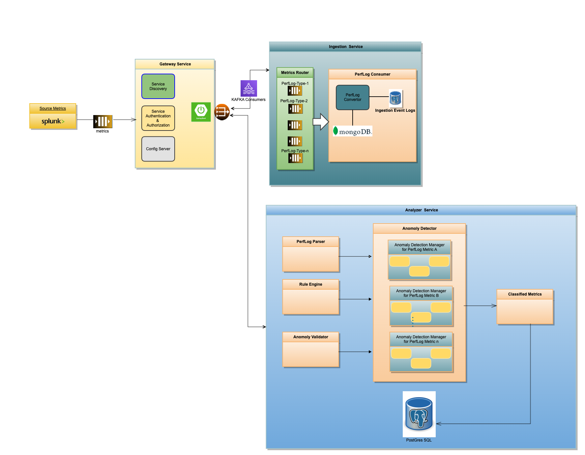

# Detailed Design Document

<!-- TOC -->
* [Detailed Design Document](#detailed-design-document)
  * [Overview](#overview)
    * [Known Problem Areas](#known-problem-areas)
    * [Identified Use-Cases](#identified-use-cases)
  * [Functional Requirements](#functional-requirements)
    * [Data Ingestion Service](#data-ingestion-service)
    * [Data Validation Service](#data-validation-service)
    * [Rule definition Engine](#rule-definition-engine)
    * [Anomaly Detection Engine](#anomaly-detection-engine)
<!-- TOC -->

| ***Date*** | ***Version*** |  ***Authors***    | ***Comments***                                                 |
|:-----------|    :---      | :---  |:---------------------------------------------------------------|  
| 10/20/2022 | V0.1 | Dowlathram, Chanduram <chanduram.dowlathram@sap.com>| 1.Initial draft created.   2.Includes Technical specs.      |
| 11/05/2022 | V0.12 | Dowlathram, Chanduram <chanduram.dowlathram@sap.com>| 1. Included Functional Requirements on  Data Ingestion Service |

## Overview
This initiative is to build an BizX data observability platform that will focus on error detection 
and identification for the identified areas of performance patterns .

This will help us analyze the behavior pattern of various  BizX modules and application 
components / services and how it scales over time for various production tenants and their 
configurations.

### Known Problem Areas

The process of Root-cause analysis  involves: 

- Analyzing and querying larger volumes of real-time data logs from Splunk,  correlating data to derive at conclusions. 

- This  consumes lots of splunk server resources which results longer query execution and turnaround time . 

- Identification  and reporting similar errors and exceptions across various modules and services are currently manual , time-consuming and repetitive process.

### Anomaly Detection Architecture

### Identified Use-Cases

These are some the use-cases identified as candidates to start with :
- **DWR Performance** - The direct web remoting  are API calls that provides faster interaction with web-servers via Ajax requests from a js file.
When the web page is AJAX enabled, it  results in large number of server hits as the client end up fetching largely dynamic documents, in order to provide a greater user experience.
Hence, monitoring DWR invocation performance is very critical to achieve pleasant user experience .
- **Count of active deadlocks** - Based on the results from this Hana service-layer splunk dashboard . We do see there are around 132 active row locks in just last 24 hours time period. This JIRA-LRN-132689 reported is to address one such dead-lock issue caused high volume of row locks.  Analyzing and reporting on all 132 active row locks manually may not be very effective approach.
- **Insights on errors on "update or delete by foreign key constraint violation"** - Multiple occurrences of the error "failed on update or delete by foreign key constraint violation:".This is observed various tables across different DC's. 

More uses cases documented in [the confluence here](https://confluence.successfactors.com/display/ENG/Data+Insights+for+error+detection+and+identification+of+performance+anomalies)
## Functional Requirements

### Data Ingestion Service 

### Data Validation Service

### Rule definition Engine

### Anomaly Detection Engine

